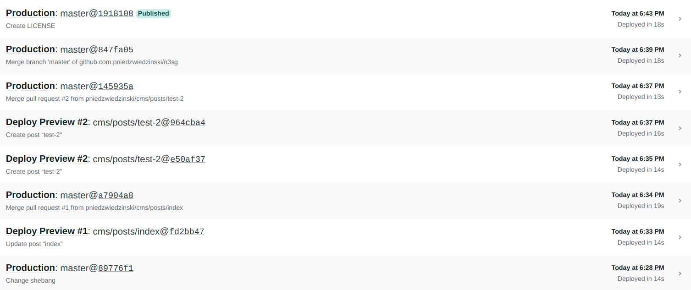
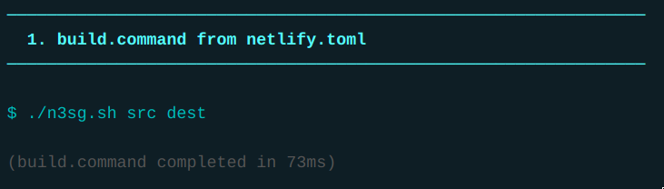

# Netlify Simple Static Site Generator

n3sg is a simple shell script for generating static sites supporting frontmatter

!!!!! This generator is not simple enough; Writing a static site generator is simple and you should write your own!

## Goal

The goal for this project is to have an extremely fast zero-dependency program
for generating multi-page static sites and also is easily compatible with
[Netlify CMS](https://www.netlifycms.org/).

## Usage

```
./n3sg.sh src dest site_name site_url
```

Copy `n3sg` and `awkdown` directly into your repo or use this repo as a template

### Development

For local development use `dev` script, which uses entr and your http server of
choice for auto-rebuilding site on file change.

```
./dev
```

## It's pretty fast



